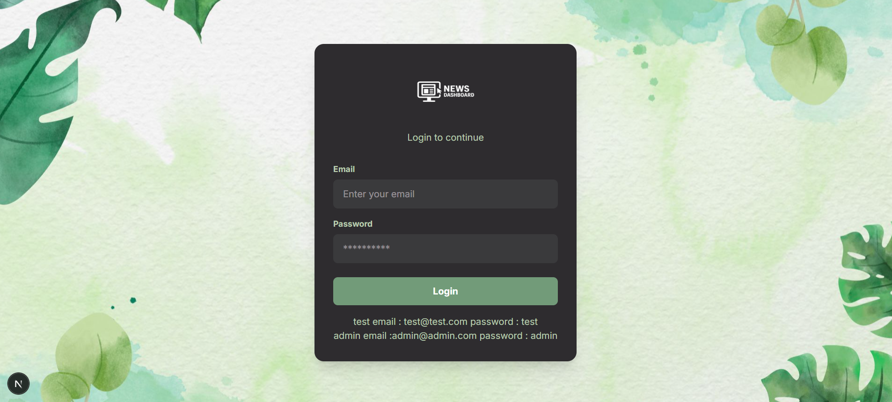
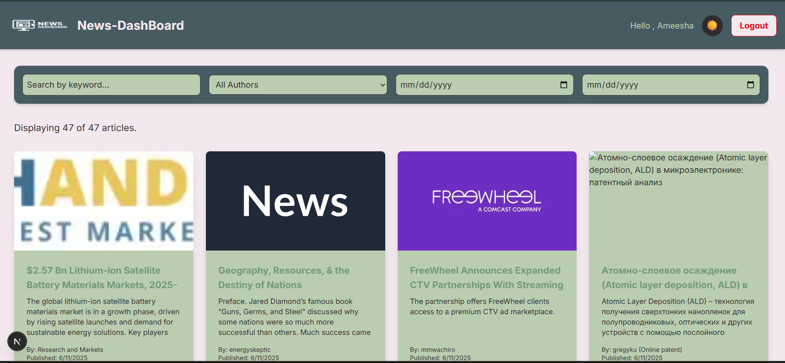

# 📰 News & Payout Dashboard

A modern, offline-first, responsive dashboard built with **Next.js** that displays live news articles and includes a powerful **admin panel** for calculating article payouts, filtering data, visualizing trends, and exporting reports.

---

## ✨ Key Features

### 🔐 Authentication
- Role-based mock login (Admin/User).
- Secure and responsive login UI.

### 🗞️ Dynamic News Feed
- Fetches live articles using a third-party News API.
- Displays news cards with image, author, date, and category.

### 📊 Admin Dashboard
- **Payout Calculator**: Admins set a per-article rate to calculate author earnings.
- **Charts**: Visual analytics of article distribution (Bar & Pie using Recharts).
- **Data Export**: Export payout data as **PDF** or **CSV** files.
- **Inline Editing** for payout rates.

### 🔍 Search & Filter
- Global keyword search.
- Filter articles by:
  - Author
  - Date range
  - Type (News/Blog)

### 📶 Offline-First Strategy
- Caches news data in **IndexedDB**.
- Fully usable offline — fallback to the most recently fetched articles.

### 🌗 Light/Dark Mode
- Toggle between light and dark themes seamlessly.

### 💻 Modern UI/UX
- Built with **Tailwind CSS** for a clean, responsive layout.
- Optimized for mobile and desktop screens.
- Uses Next.js `<Image />` for high-performance image rendering.

---

## 🚀 Live Preview

> **Note:** Due to **NewsAPI restrictions**, live API works only on `localhost`. The Vercel-deployed version may show an API error after initial load, but the app gracefully falls back to cached articles stored in IndexedDB.

---

## 🖼 Screenshots

<div align="center">



**<div style="font-size:30px; margin-top: 5px;">Login Page</div>**

---



**<div style="font-size:30px; margin-top: 5px;">Dashboard</div>**

---


**<div style="font-size:30px; margin-top: 5px;">Articles</div>**

---


**<div style="font-size:30px; margin-top: 5px;">Analytics</div>**

---


</div>

---

## 🛠️ Tech Stack

| Feature              | Tool/Library        |
|----------------------|---------------------|
| Framework            | Next.js (App Router) |
| Styling              | Tailwind CSS         |
| Charts               | Recharts             |
| State Management     | React Context API    |
| Offline Storage      | IndexedDB            |
| Export               | jsPDF, SheetJS       |
| Hosting              | Vercel               |

---

## 📦 Getting Started

### 1. Clone the Repository

```bash
git clone https://github.com/your-username/news-dashboard.git
cd news-dashboard

```
## 2. Install Dependencies

```bash
npm install   # or yarn install
```

### 3. Environment Setup

Create a `.env.local` file with:

```env
NEXT_PUBLIC_NEWS_API_KEY=your_newsapi_key
NEXT_PUBLIC_GOOGLE_SHEETS_API_KEY=your_sheets_api_key
```

### 4. Run Locally

```bash
npm run dev   # or yarn dev
```

---

## 🔒 Admin Login (Demo)

Use the following credentials for the admin panel:

```
Email: admin@admin.com
Password: admin
```

---

## 🔒 User Login (Demo)

Use the following credentials for the user panel:

```
Email: test@test.com
Password: test
```

---

## 📤 Export Functionality

- Exports payout summaries by author.  
- Supported formats: **CSV**, **PDF**  

## 📧 Contact

[Ameesha Shukla](mailto:ameesha899@gmail.com)
